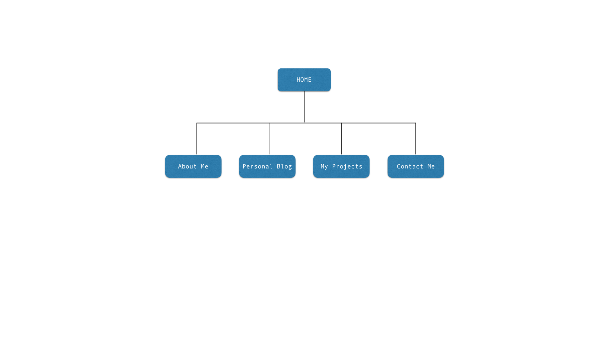

## What are the 6 Phases of Web Design?
1. Information gathering
2. Planning
3. Design
4. Development
5. Testing & Delivery
6. Maintenance

## What is your site's primary goal or purpose? What kind of content will your site feature?

My site's primary goal would be to exhibit my development, design and project management skills so that users especially recruiters are impressed and offer me available positions.

Initially I will blog once a day about development world. Additionally I will showcase the projects I am involved.

## What is your target audience's interests and how do you see your site addressing them?

Altough many users from different walks of life may visit the site, my target audience will be recruiters. Recruiters interests are very busy people so they would be interested in the following (ref: [http://qz.com/525496/done-what-a-recruiter-sees-on-your-resume-at-first-glance](http://qz.com/525496/done-what-a-recruiter-sees-on-your-resume-at-first-glance)

#### Most recent role.
I’m generally trying to figure out what this person’s current status is, and why/if they might even be interested in a new role. Have they only been in their last position for three months? If so, probably not the best time for me to reach out, right? Unless they work for Zynga, or somewhere tragic like that (said with great respect for Farmville, the app that put Facebook apps on the map). If it’s an incoming resume, I’m wondering why the candidate is looking now. Are they laid off? Did they get fired? Have they only been in their role for a few months and they’re possibly hating it? But most importantly, is their most recent experience relevant to the position for which I’m hiring?

#### Company recognition.
Not even gonna lie. I am a company snob. Now don’t get all Judgy McJudgerson about my judgy-ness. Hear me out. It’s not even that I think certain companies are better than others (although some most certainly are). It’s purely a matter of how quickly can I assign a frame of reference. This is also known as “credibility.” Oh you worked at Amazon? Then you’re probably accustomed to working on projects at scale. You’re at a well known crash-and-burn start-up? You have probably worn many hats and have been running at a sprinter’s pace. There are some pretty blatant if/then associations I can make simply by recognizing a company name. Because recruiters have generally been doing this job for awhile, we notice patterns and trends among candidates from certain companies and we formulate assumptions as a result. There are edge cases and our assumptions can fail us, but again, this is a resume review; we’re talking a less than 20-second analysis. Assigning frame of reference is often more difficult to do when a candidate has only worked for obscure companies I’ve never heard of. When I can’t assign company recognition, it just means I have to read the resume a little deeper, which usually isn’t an issue, unless it’s poorly formatted, poorly written, uninformative, and wrought with spelling errors—in which case, you might have lost my interest.
Overall experience. Is there a career progression? Does the person have increasing levels of responsibility? Do the titles make sense? (You’re a VP of Marketing for a five-person company? Heck, I would be too.) Do the responsibilities listed therein match what I’m looking for?

#### Keyword search.
Does the person have the specific experience for the role I’m hiring for? There have been times when I command + F the crap out of resumes. Especially the long ones that are hard to follow. This isn’t fool proof, but if I’m looking for an iOS engineer, for example, and the words “iOS” or “objective-c” don’t even make a cameo appearance in someone’s resume, I have to furrow my brow, read a little deeper and figure out what the heck is going on. Throughout my career supporting hiring for different profiles, I’ve done this on many occasions searching for things like Ruby on Rails, Mule, Javascript, and seriously, anything you can think of. Now if you’re thinking you should “key word” it up on your resume, think again. Keep it authentic. And don’t you dare think of putting your resume online and embed 250 irrelevant key words at the bottom in 5pt white text. I’m on to you. But I do think you should be vigilant to ensure that the actual important key words contained in the meat of your experience are represented on your resume.
Gaps. I don’t mind gaps so long as there’s a sufficient explanation. Oh you took three years off to raise your children? Fine by me, and might I add: #respect. You tried your hand at starting your own company and failed miserably? Very impressive! Gap sufficiently explained. Whatever it is, just say it. It’s the absence of an explanation that makes me wonder. Still, I understand that sometimes people feel uncomfortable sharing certain things in a professional context. If you had a gap, surely you were busy doing something during that time, right? Get creatively honest and just name that period of your life in a way that shows you acknowledge that it might raise an eyebrow.
#### Personal online footprint.
This is not required. But if you have an online footprint, and you’ve bothered to include it in your resume, I’m gonna click. This includes personal domains, Quora profiles, Twitter handles, GitHub contributions, Dribbble accounts, or anything a candidate has chosen to list. Two out of three times, I almost always click through to a candidate’s website or Twitter account. It’s one of my favorite parts of recruiting. You never know what you’re gonna get.

#### General logistics.
Location, eligibility to work in the US. I try to make some raw guesses here, but this is not a place of weeding someone out, more just trying to figure out their story.
Overall organization. This includes spelling, grammar, ease of use, ability to clearly present ideas. If you’re in marketing and you’ve lost me in the first three bullets, I have concerns.

**Total time it takes me to do all of above: < 25 seconds.**

## What is the primary "action" the user should take when coming to your site? Do you want them to search for information, contact you, or see your portfolio? It's ok to have several actions at once, or different actions for different kinds of visitors.

1. Get a quick response (under 25 seconds) to the questions above...
2. See my portfolio
3. Contact me

## What are the main things someone should know about design and user experience?
A/B testing 
User Surveys
User Personas and Stories
Wireframes and prototyping
User flows
Story telling
Design patterns

## What is user experience design and why is it valuable? 
Regardless of how attractive a website is, how retina the graphics or a mobile applications is it all comes down to how users perceive it. They ask themselves "Does this system give me a value? Is it user friendly? Am I getting the information I need when I needed?"

UX designs target is to provide positive answers to all these questions. UI is not UX.

UX engineers (they should be called engineers not designers) study and evaluate how users feel about a system, looking at such things as ease of use, perception of the value of the system, utility, efficiency in performing tasks and so forth.

Their work makes it or breaks it. That is why it is so valuable.

## Which parts of the challenge did you find tedious?
None...
