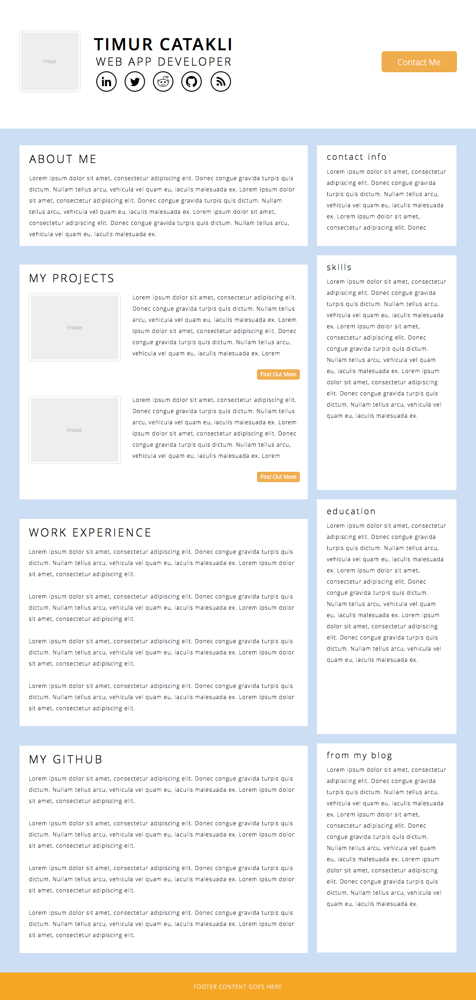
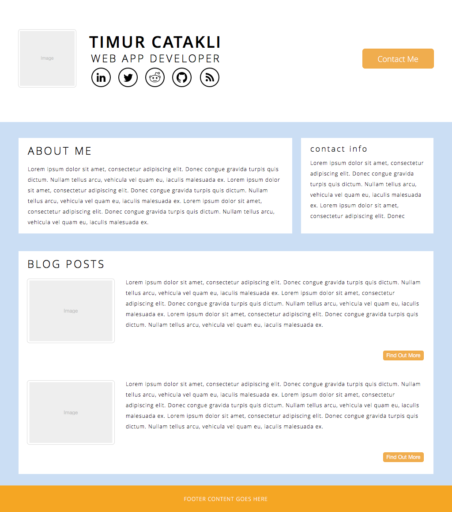

### HOMEPAGE INDEX WIREFRAME

### HOMEPAGE BLOG INDEX WIREFRAME

### What is a wireframe?

It's like an architectural blueprint. It is an image or set of images which displays the functional elements of a website, mobile app or page, typically used for planning a site's structure and functionality.

### What are the benefits of wireframing?

It is very useful in determining how the user interacts with the interface. Wireframing is also important because it allows the designer to plan the layout and interaction of an interface without being distracted by colors, typeface choices or even copy. Like the foundation of a building, it has to be fundamentally strong before you decide whether to give it an expensive coat of paint.

### Did you enjoy wireframing your site?

Yes, very much so...

### Did you revise your wireframe or stick with your first idea?

Revised it at least 6-7 times...

### What questions did you ask during this challenge? What resources did you find to help you answer them?

I was mainly concerned with selecting the right tool. After some research I decided to go with .

### Which parts of the challenge did you enjoy and which parts did you find tedious?

Having a plan and seeing it come alive (even it is a wireframe) was pretty enjoyable. Tedious part of the challenge is that it consumes a lot of time...