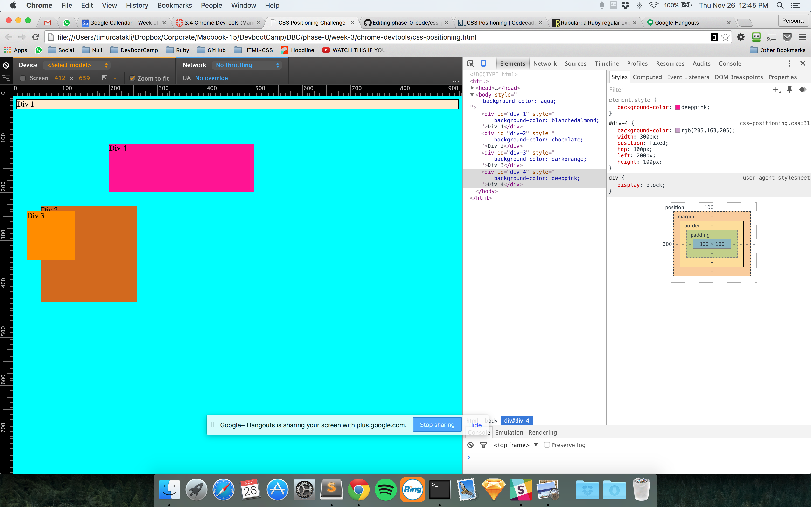
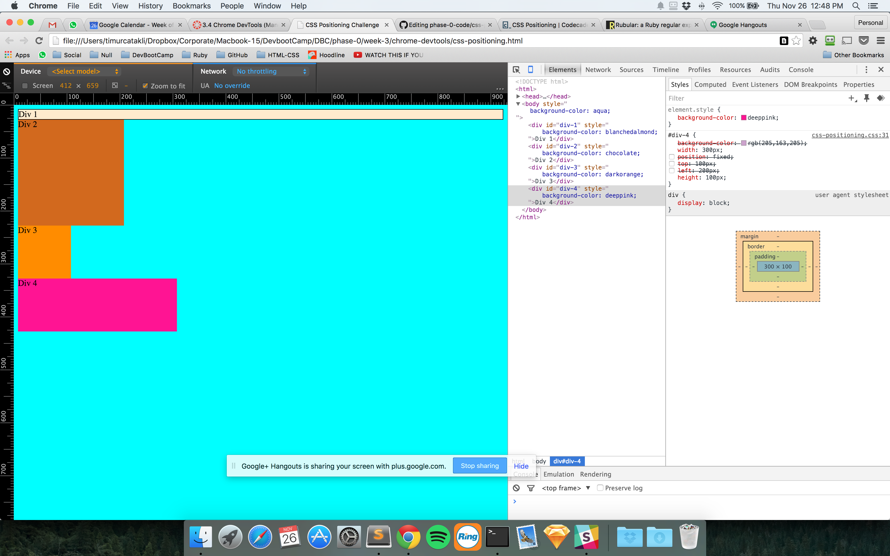
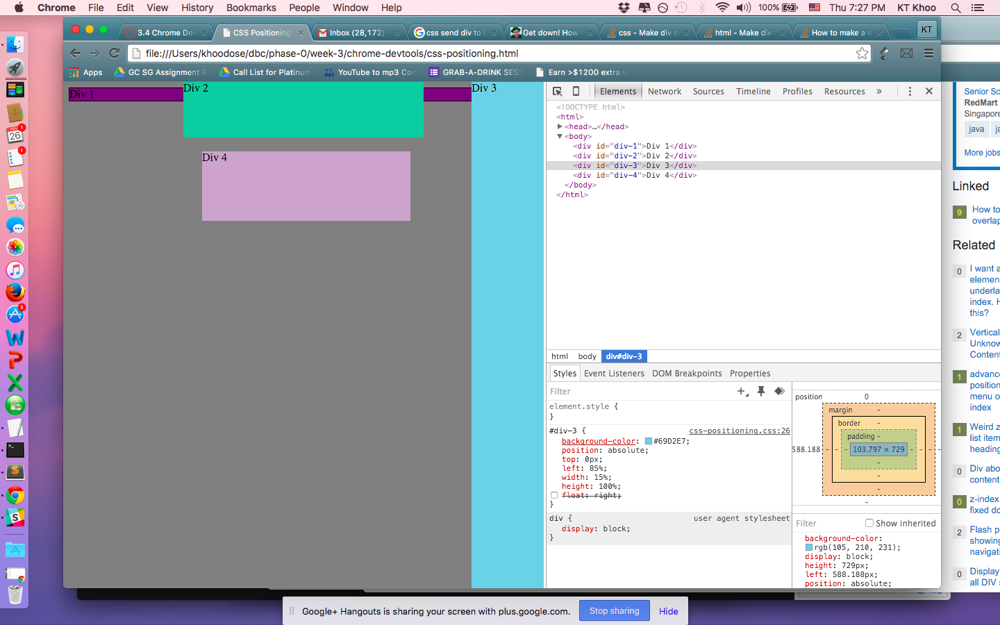
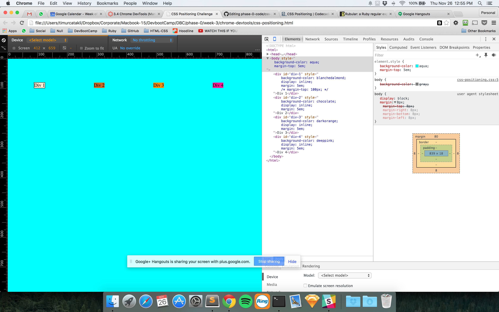
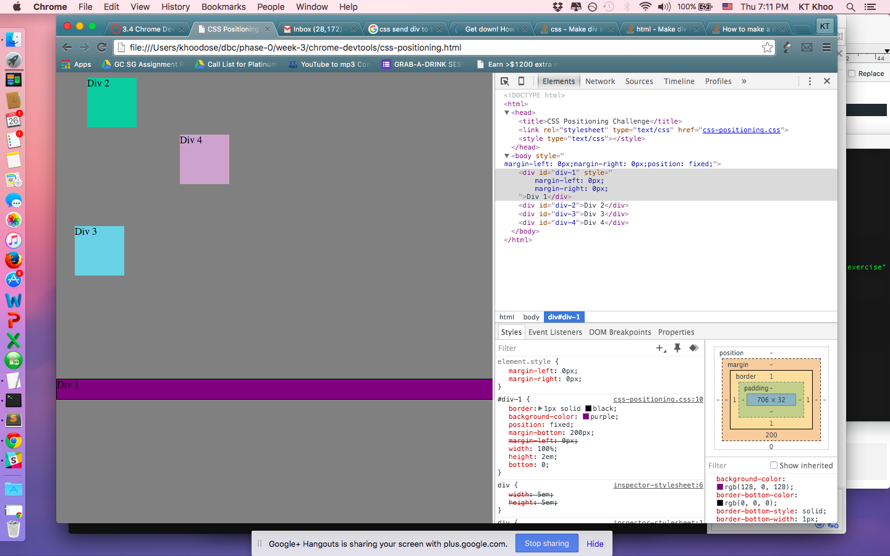
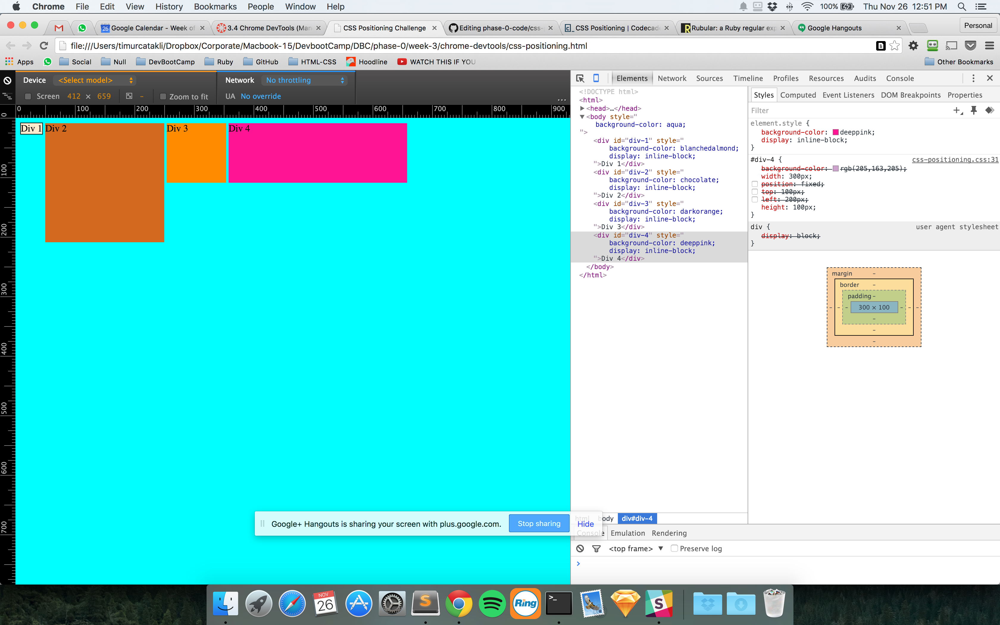
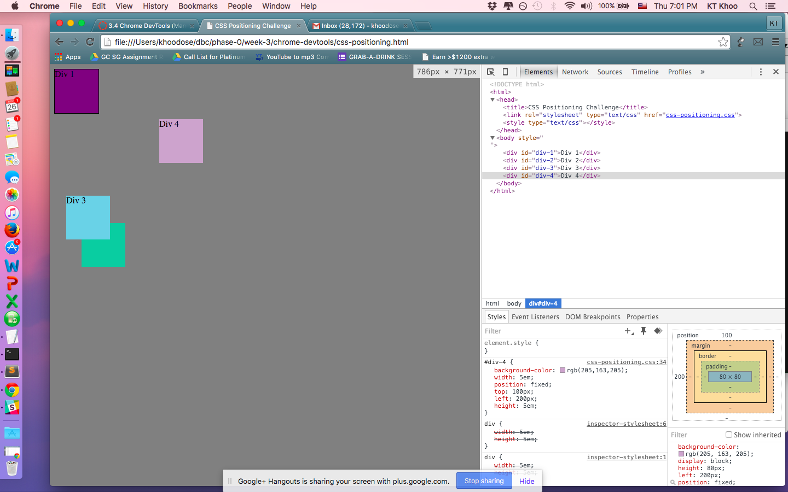
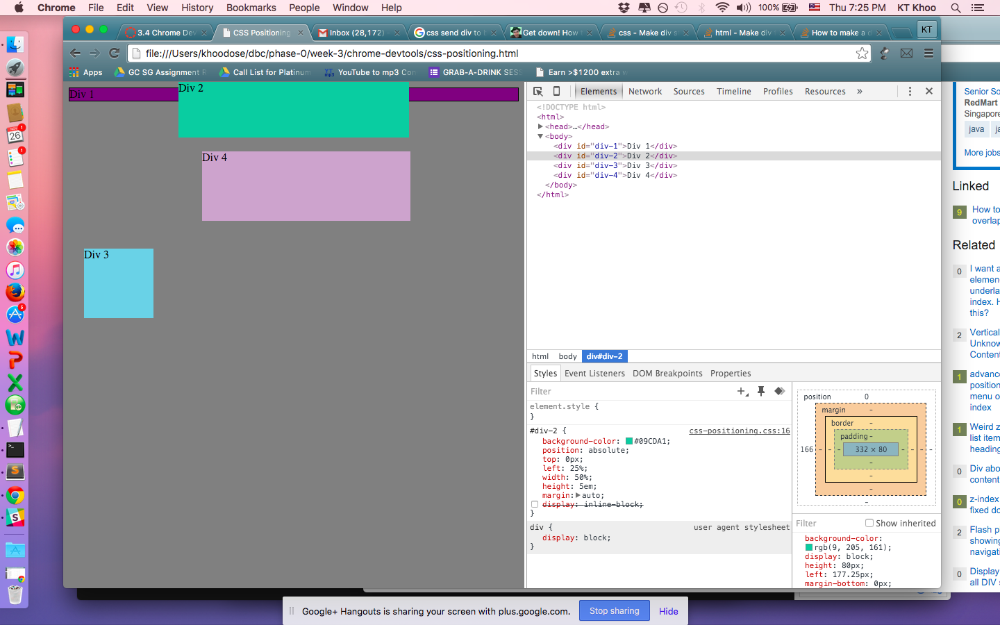
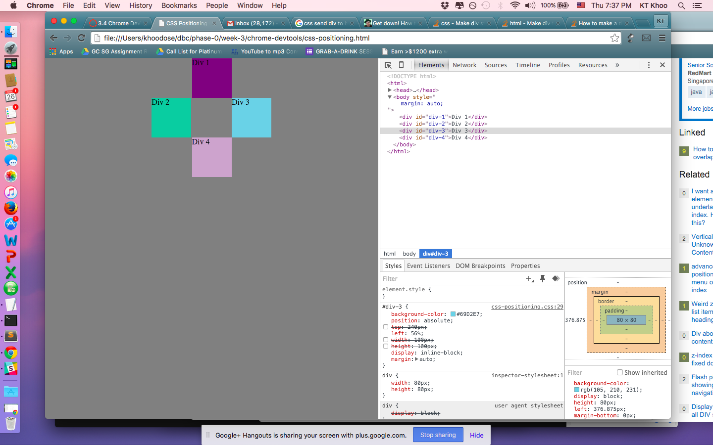

### How can you use Chrome's DevTools inspector to help you format or position elements?
When in the console's multi-line editing mode, you can treat blocks of text as if you were using a standard text editor. Shift + Enter allows you enter multi-line mode in the console.

1. ⌥⌘I (Command - Option - I) keys to open Developer Tools
2. ⌥⌘J (Command - Option - J) to open Developer Tools and bring focus to the Console.
3. ^⌘C (Control - Option - C) to toggle Inspect Element mode.

### How can you resize elements on the DOM using CSS?

### What are the differences between absolute, fixed, static, and relative positioning? Which did you find easiest to use? Which was most difficult?

Static. This is the default for every single page element. Different elements don't have different default values for positioning, they all start out as static. Static doesn't mean much, it just means that the element will flow into the page as it normally would. The only reason you would ever set an element to position: static is to forcefully-remove some positioning that got applied to an element outside of your control. This is fairly rare, as positioning doesn't cascade.
Relative. This type of positioning is probably the most confusing and misused. What it really means is "relative to itself". If you set position: relative; on an element but no other positioning attributes (top, left, bottom or right), it will no effect on it's positioning at all, it will be exactly as it would be if you left it as position: static; But if you DO give it some other positioning attribute, say, top: 10px;, it will shift it's position 10 pixels DOWN from where it would NORMALLY be. I'm sure you can imagine, the ability to shift an element around based on it's regular position is pretty useful. I find myself using this to line up form elements many times that have a tendency to not want to line up how I want them to.
There are two other things that happen when you set position: relative; on an element that you should be aware of. One is that it introduces the ability to use z-index on that element, which doesn't really work with statically positioned elements. Even if you don't set a z-index value, this element will now appear on top of any other statically positioned element. You can't fight it by setting a higher z-index value on a statically positioned element. The other thing that happens is it limits the scope of absolutely positioned child elements. Any element that is a child of the relatively positioned element can be absolutely positioned within that block. This brings up some powerful opportunities which I talk about here.
Absolute. This is a very powerful type of positioning that allows you to literally place any page element exactly where you want it. You use the positioning attributes top, left bottom and right to set the location. Remember that these values will be relative to the next parent element with relative (or absolute) positioning. If there is no such parent, it will default all the way back up to the <html> element itself meaning it will be placed relatively to the page itself.
The trade-off, and most important thing to remember, about absolute positioning is that these elements are removed from the flow of elements on the page. An element with this type of positioning is not affected by other elements and it doesn't affect other elements. This is a serious thing to consider every time you use absolute positioning. It's overuse or improper use can limit the flexibility of your site.
Fixed. This type of positioning is fairly rare but certainly has its uses. A fixed position element is positioned relative to the viewport, or the browser window itself. The viewport doesn't change when the window is scrolled, so a fixed positioned element will stay right where it is when the page is scrolled, creating an effect a bit like the old school "frames" days. Take a look at this site (update: dead link, sorry), where the left sidebar is fixed. This site is a perfect example for since it exhibits both good and bad traits of fixed positioning. The good is that it keeps the navigation present at all times on the page and it creates and interested effect on the page. The bad is that there are some usability concerns. On my smallish laptop, the content in the sidebar is cut off and there is no way from me to scroll down to see the rest of that content. Also if I scroll all the way down to the footer, it overlaps the footer content not allowing me to see all of that. Cool effect, can be useful, but needs to be thoroughly tested.

### What are the differences between margin, border, and padding?

All HTML elements can be considered as boxes. In CSS, the term "box model" is used when talking about design and layout.

The CSS box model is essentially a box that wraps around every HTML element. It consists of: margins, borders, padding, and the actual content.

Content - The content of the box, where text and images appear
Padding - Clears an area around the content. The padding is transparent
Border - A border that goes around the padding and content
Margin - Clears an area outside the border. The margin is transparent

### What was your impression of this challenge overall? (love, hate, and why?)
Love - Challenging