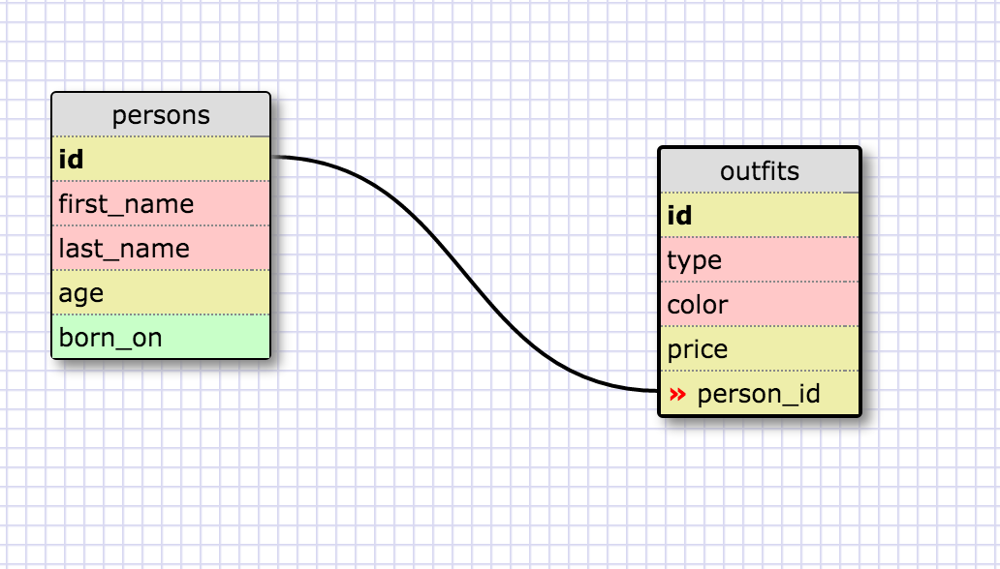

##Release 5: SELECTing data from a database##

`CREATE TABLE states(id smallint, state_name varchar(30), population_density float, population int, region_id smallint);`

`CREATE TABLE regions(id smallint, region_name varchar(255));`

###Select all data for all states.###
`SELECT * FROM states;`

###Select all data for all regions.###
`SELECT * FROM regions;`

###Select the state_name and population for all states.###
`SELECT state_name, population FROM states;`

###Select the state_name and population for all states ordered by population. The state with the highest population should be at the top.###
`SELECT state_name, population FROM states ORDER BY population DESC;`

###Select the state_name for the states in region 7.###
`SELECT state_name FROM states WHERE region_id = 7;`

###Select the state_name and population_density for states with a population density over 50 ordered from least to most dense.###
`SELECT state_name, population_density FROM states WHERE population_density > 50 ORDER BY population_density ASC;`

###Select the state_name for states with a population between 1 million and 1.5 million people.###
`SELECT state_name FROM states WHERE population BETWEEN 1000000 AND 1500000;`

###Select the state_name and region_id for states ordered by region in ascending order.###
`SELECT state_name, region_id FROM states ORDER BY region_id ASC;`

###Select the region_name for the regions with "Central" in the name.###
`SELECT region_name FROM regions WHERE region_name LIKE "%central%";`

###Select the region_name and the state_name for all states and regions in ascending order by region_id. Refer to the region by name. (This will involve joining the tables).###

`SELECT regions.region_name, states.state_name FROM regions JOIN states ON regions.id = states.region_id;`

###Person Outfit DB Schema###

###Reflect###
**What are databases for?**
A database is a collection of information that is organized so that it can easily be accessed, managed, and updated. In one view, databases can be classified according to types of content: bibliographic, full-text, numeric, and images.

**What is a one-to-many relationship?**
In this kind of relationship, a row in table A can have many matching rows in table B. But a row in table B can have only one matching row in table A. For example, the "Publishers" and "Titles" tables have a one-to-many relationship. That is, each publisher produces many titles.

**What is a primary key? What is a foreign key? How can you determine which is which?**
A table typically has a column or combination of columns that contain values that uniquely identify each row in the table. This column, or columns, is called the primary key (PK) of the table and enforces the entity integrity of the table. Because primary key constraints guarantee unique data, they are frequently defined on an identity column.

A foreign key (FK) is a column or combination of columns that is used to establish and enforce a link between the data in two tables to control the data that can be stored in the foreign key table.

**How can you select information out of a SQL database? What are some general guidelines for that?**
The select statement is used to query the database and retrieve selected data that match the criteria that you specify. Here is the format of a simple select statement:

select "column1"
  [,"column2",etc] 
  from "tablename"
  [where "condition"];
  [] = optional
The column names that follow the select keyword determine which columns will be returned in the results. You can select as many column names that you'd like, or you can use a "*" to select all columns.

The table name that follows the keyword from specifies the table that will be queried to retrieve the desired results.

The where clause (optional) specifies which data values or rows will be returned or displayed, based on the criteria described after the keyword where.

Conditional selections used in the where clause:

