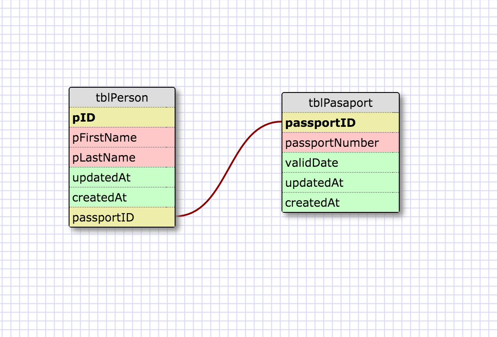
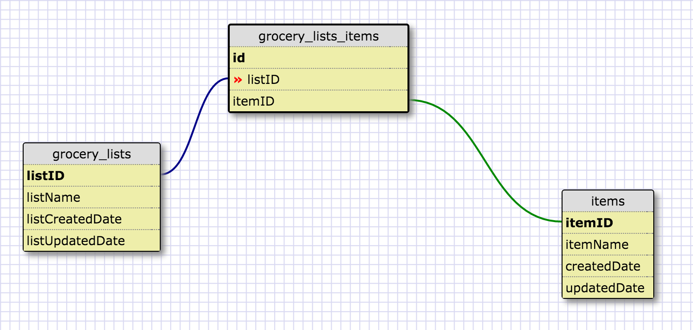

##Create a One-to-one Schemas##

Each person owns one passport and that passport can be owned by one person.
As person and passport properties might be quite a long list, it is a good idea to put them in seperate tables and have a one-to-one relationship.

##Many to Many Relationships##

##Reflect##

###What is a one-to-one database?###
In a one-to-one relationship, each row in one database table is linked to one and only one other row in another table. In a one-to-one relationship between Table A and Table B, each row in Table A is linked to another row in Table B.

###When would you use a one-to-one database? (Think generally, not in terms of the example you created).###
if a database table contains a few columns of data that is frequently used and the remaining columns being infrequently used, the database designer may split the single table into 2 tables linked through a one-to-one relationship. Such a design would reduce the overhead needed to retrieve the infrequently used columns whenever query is performed on the contents of the database table.

###What is a many-to-many database?###
In a many-to-many relationship, one or more rows in a table can be related to 0, 1 or many rows in another table. A mapping table is required in order to implement such a relationship.

###When would you use a many-to-many database? (Think generally, not in terms of the example you created).###
For example, all the customers belonging to a bank is stored in a customer table while all the bank's products are stored in a product table. Each customer can have many products and each product can be assigned to many customers.

###What is confusing about database schemas? What makes sense?###
The confusing part of database schemas surfaces when you have tens of tables. Also the data types and sizes needs to be carefully decided. Which makes the whole process confusing... It all makes sense to separate data into tables and connect them if needed.